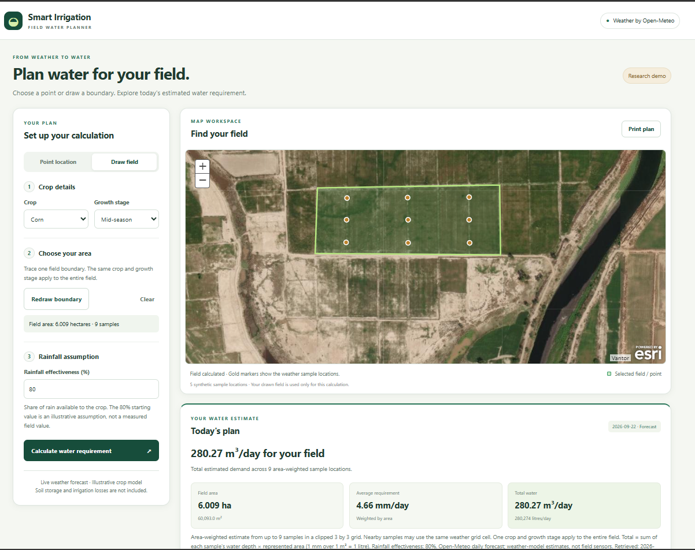

# Smart Irrigation Dashboard

Estimate daily crop water requirements from live Open-Meteo forecasts. Select a
point or draw a field to see its area and total water requirement in litres and m³.

## Install Python first

Use **Python 3.13** for the tested setup (minimum: Python 3.12).
You can keep other Python installations; the project uses its own environment.

**Windows**

1. Open [Python downloads for Windows](https://www.python.org/downloads/windows/)
   and choose a Python **3.13.x** release. Download its Windows installer for your computer.
2. Run the installer, select **Add Python to PATH**, and keep **pip** and the
   **Python launcher** enabled. Complete the installation.
3. Close and reopen PowerShell, then check:

   ```powershell
   py -3.13 --version
   ```

   It should display `Python 3.13.x`. If `py` is not recognized, reopen the
   installer and enable the Python launcher, then reopen PowerShell.

**macOS / Linux**

- macOS: install Python 3.13 using the installer from
  [Python downloads for macOS](https://www.python.org/downloads/macos/).
- Linux: install Python 3.12+ and its `venv` support using your distribution's
  package manager. On Ubuntu/Debian releases that provide Python 3.12+:
  `sudo apt update` then `sudo apt install python3 python3-venv python3-pip`.
- Run `python3 --version` and confirm **3.12 or newer**. If another version is
  selected but 3.13 is installed, use `python3.13` instead of `python3` below.
  If neither is available, install a supported version before continuing.

## Setup

Download and extract this repository, or clone it. Open a terminal in the folder
containing `manage.py` (on Windows, right-click that folder → **Open in Terminal**).
Internet access is required for package installation, maps and weather.

### Windows (PowerShell)

```powershell
py -3.13 -m venv .venv
.\.venv\Scripts\python.exe -m pip install -r requirements.txt
.\.venv\Scripts\python.exe manage.py migrate
.\.venv\Scripts\python.exe manage.py runserver
```

### macOS / Linux

```sh
python3 -m venv .venv
.venv/bin/python -m pip install -r requirements.txt
.venv/bin/python manage.py migrate
.venv/bin/python manage.py runserver
```

Open **http://127.0.0.1:8000/**. Keep the terminal running; press **Ctrl+C** to stop.
No database server or API key is needed for this non-commercial demo.

**No environment activation is needed:** the commands call the project's Python
directly. Packages stay inside `.venv`. If `.venv` was created using an older
Python version, remove only that generated `.venv` folder and repeat setup.
For later runs, use just the `manage.py runserver` command shown above.

## Use the dashboard

1. Select a crop and growth stage.
2. Choose **Point location**, or **Draw field → Draw boundary**.
3. For a field, click each corner and double-click the final corner to finish.
4. Adjust rainfall effectiveness if needed, then press **Calculate**.

Point results show mm/day. Field results also show area, litres/day and m³/day,
using up to nine area-weighted weather samples. Use **Clear** or **Redraw boundary**
to change the field. Drawn boundaries are not saved.

## Sample database

The included `db.sqlite3` contains five synthetic locations and no user accounts.
If rebuilding a missing database, run `migrate` above, then load the samples:

```powershell
.\.venv\Scripts\python.exe manage.py loaddata demo_poles
```

On macOS/Linux, use `.venv/bin/python` instead. Reloading the fixture replaces
sample records with IDs 1–5; do not run it over custom records with those IDs.

## Calculation notes

- Daily depth: `max(0, reference ET × crop coefficient − effective rainfall)`.
- Field volume: sum of each sample's depth × represented area; **1 mm over 1 m² = 1 litre**.
- Weather is a forecast, not a field measurement. Crop coefficients and the
  default 80% rainfall effectiveness are illustrative; soil storage and irrigation
  losses are excluded. This is a local research demo, not a validated irrigation model.
- Weather requests: `backend/api/open_meteo_api.py`. Polygon calculations:
  `backend/api/polygon_water.py`.

Weather: [Open-Meteo](https://open-meteo.com/) · [CC BY 4.0](https://creativecommons.org/licenses/by/4.0/).
See [Open-Meteo usage plans](https://open-meteo.com/en/pricing) for commercial use.

## Tests

```powershell
.\.venv\Scripts\python.exe manage.py test backend
```

Tests use a temporary SQLite database and mocked weather. Optional settings are
documented in `.env.example`; `.env` files are not loaded automatically.


## Interface 
- Followig are the Screen shots attached below to give an idea, how interface will look like and how it will be operated.



- Further details of each point with in the selected polygon


- How to change crop type and it's growth stage.


